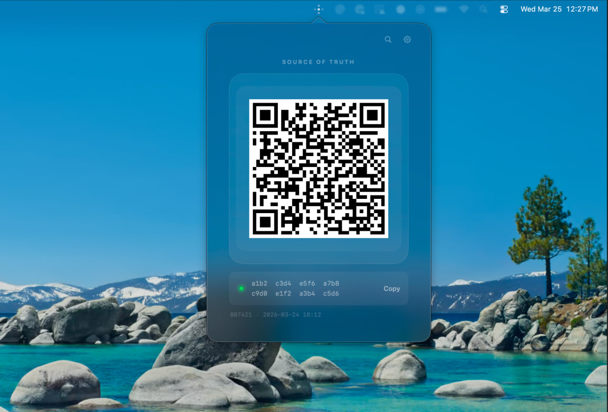

# Veritas

A menu bar trust anchor for the [Spaces protocol](https://spacesprotocol.org). Embeds a Bitcoin light node and a spaces client to verify handles directly - no trusted servers.



## Structure

```
Cargo.toml         Single Rust package at root
core/src/          Rust library sources
core/bin/          Rust binary entry points
app/               macOS/iOS app (Xcode)
build-core.sh      Builds the Rust library and copies Swift bindings into app/
```

## How to create a searchable note

Publish any nostr note on a relay and use `#veritas`. Make sure, the ADDR record you publish to certrelay has the nostr relay included e.g.

```
type=addr, key=nostr, value = [ "npub1...", "wss://relay.example.com" ]
```


## Building

### Rust

```bash
cargo build
```

Run the CLI standalone:

```bash
cargo run --bin veritas
```

See [core/README.md](core/README.md) for CLI options and architecture details.

### Swift bindings + app

Build the Rust library for all Apple targets and copy bindings into the Xcode project:

```bash
./build-core.sh
```

Then open `app/veritas.xcodeproj` in Xcode and build normally.

## License

Licensed under the [Apache License, Version 2.0](LICENSE).